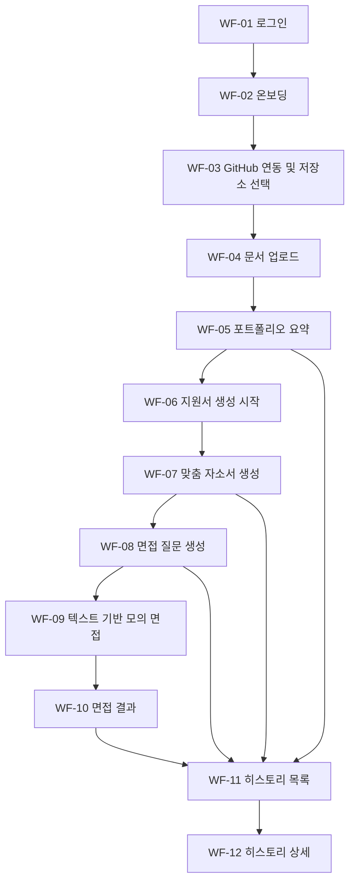

# AI 기술 면접 연습 플랫폼 와이어프레임 초안

## 1. 문서 개요

- 버전: v0.1
- 기준 문서:
  - AI 기술 면접 연습 플랫폼 요구사항 명세서 v0.2
  - AI 기술 면접 연습 플랫폼 ERD 초안 v0.1
  - AI 기술 면접 연습 플랫폼 WBS v0.1
- 작성 목적:
  - MVP 범위 기준 핵심 화면 구조를 정의한다.
  - 사용자 흐름과 화면 전환을 명확히 한다.
  - 이후 API 설계, 프론트엔드 구현, 발표 자료 제작의 기준으로 사용한다.

## 2. 작성 전제

- 대상: 일반 사용자용 웹 서비스
- 범위: 1차 MVP
- 기준 디바이스: Desktop First
- 반응형 대응: 태블릿/모바일 축소 대응은 고려하되, 본 문서는 데스크톱 기준으로 작성한다.
- 제외 범위:
  - 관리자 화면
  - 결제 화면
  - 커뮤니티 화면
  - 음성/영상 면접 화면

## 3. 설계 원칙

- 사용자는 로그인 후 바로 포트폴리오 등록 흐름으로 진입할 수 있어야 한다.
- 포트폴리오 등록, 자소서 생성, 면접 준비, 결과 조회가 하나의 연속 흐름처럼 보여야 한다.
- AI 생성 과정은 사용자가 현재 어떤 데이터를 기반으로 생성 중인지 확인할 수 있어야 한다.
- 주요 화면은 빈 상태, 로딩 상태, 오류 상태를 고려해야 한다.
- 재진입 사용자는 최근 지원서와 최근 면접 결과를 빠르게 다시 열 수 있어야 한다.

## 4. 전체 화면 구조

### 4.1 화면 목록

- WF-01 로그인 화면
- WF-02 온보딩 및 포트폴리오 시작 화면
- WF-03 GitHub 연동 및 저장소 선택 화면
- WF-04 문서 업로드 화면
- WF-05 포트폴리오 요약 화면
- WF-06 지원서 생성 시작 화면
- WF-07 맞춤 자소서 생성 화면
- WF-08 면접 질문 생성 화면
- WF-09 텍스트 기반 모의 면접 화면
- WF-10 면접 결과 화면
- WF-11 히스토리 목록 화면
- WF-12 히스토리 상세 화면

### 4.2 사용자 흐름 요약



### 4.3 기능 요구사항 매핑

- FR-01 회원가입 및 인증: WF-01
- FR-02 포트폴리오 수집 및 저장: WF-02, WF-03, WF-04, WF-05
- FR-03 맞춤 자소서 생성: WF-06, WF-07
- FR-04 면접 질문 생성: WF-08
- FR-05 텍스트 기반 모의 면접: WF-09
- FR-06 면접 결과 저장 및 히스토리 조회: WF-10, WF-11, WF-12

## 5. 공통 레이아웃

### 5.1 공통 상단 영역

- 좌측: 서비스 로고
- 중앙 또는 좌측: 현재 진행 단계 표시
- 우측:
  - 사용자 프로필
  - 로그아웃
  - 히스토리 이동

### 5.2 공통 좌측 네비게이션

- 대시보드
- 포트폴리오
- 자소서 생성
- 면접 질문
- 모의 면접
- 히스토리

### 5.3 공통 상태 UI

- 로딩: 스켈레톤 또는 단계 메시지
- 오류: 실패 원인 + 재시도 버튼
- 빈 상태: 다음 행동 유도 버튼
- 완료: 저장 완료, 생성 완료, 제출 완료 토스트

## 6. 화면 상세

---

## WF-01 로그인 화면

### 목적

- 사용자가 GitHub, Google, Kakao 중 하나로 로그인하도록 유도한다.

### 주요 요소

- 서비스 소개 문구
- 로그인 버튼 3종
- 서비스 핵심 가치 요약
- 하단 약관/개인정보처리방침 링크

### 주요 액션

- GitHub로 로그인
- Google로 로그인
- Kakao로 로그인

### 전이

- 로그인 성공 시 신규 사용자는 WF-02로 이동
- 로그인 성공 시 기존 사용자는 최근 작업 상태에 따라 WF-05 또는 WF-11로 이동 가능

### ASCII 와이어프레임

```text
+--------------------------------------------------------------------------------+
| LOGO                                                            히스토리 없음  |
+--------------------------------------------------------------------------------+
|                                                                                |
|  개발자 취업 준비를 하나의 흐름으로                                            |
|  GitHub, 이력서, 자소서를 연결해 면접까지 준비                                  |
|                                                                                |
|  [ GitHub 로그인 ]                                                             |
|  [ Google 로그인 ]                                                             |
|  [ Kakao 로그인 ]                                                              |
|                                                                                |
|  핵심 기능                                                                     |
|  - 포트폴리오 자동 수집                                                        |
|  - 맞춤 자소서 생성                                                            |
|  - 예상 면접 질문 생성                                                         |
|  - 텍스트 기반 모의 면접                                                       |
|                                                                                |
|  이용약관 | 개인정보처리방침                                                   |
+--------------------------------------------------------------------------------+
```

---

## WF-02 온보딩 및 포트폴리오 시작 화면

### 목적

- 첫 로그인 사용자가 서비스 시작 흐름을 이해하고 포트폴리오 등록을 시작하게 한다.

### 주요 요소

- 진행 단계 표시
- 포트폴리오 등록 안내
- GitHub 연동 시작 버튼
- 문서 업로드 시작 버튼
- 나중에 하기 옵션

### ASCII 와이어프레임

```text
+--------------------------------------------------------------------------------+
| LOGO                  포트폴리오 등록 > 자소서 생성 > 면접 준비 > 결과 확인     |
+--------------------------------------------------------------------------------+
|                                                                                |
|  환영합니다. 먼저 포트폴리오를 등록해주세요.                                     |
|                                                                                |
|  [ 1. GitHub 연동 시작 ]                                                       |
|  [ 2. 이력서/증빙 업로드 ]                                                     |
|                                                                                |
|  안내                                                                          |
|  - repository와 commit을 불러옵니다.                                           |
|  - 이력서 PDF에서 텍스트를 추출합니다.                                          |
|  - 저장된 데이터는 자소서와 면접 생성에 재사용됩니다.                           |
|                                                                                |
|  [ 지금 시작하기 ]        [ 나중에 하기 ]                                       |
+--------------------------------------------------------------------------------+
```

---

## WF-03 GitHub 연동 및 저장소 선택 화면

### 목적

- GitHub 계정 연동 또는 URL 입력을 통해 repository 목록을 조회하고 선택하게 한다.

### 주요 요소

- GitHub 연동 상태 카드
- GitHub URL 입력 필드
- repository 목록 테이블 또는 카드 리스트
- 선택한 저장소 수 표시
- commit 수집 시작 버튼

### 상태

- 빈 상태: 아직 repository를 불러오지 않은 상태
- 로딩 상태: repository 목록 조회 중
- 오류 상태: 권한 부족, URL 오류, 연결 실패

### ASCII 와이어프레임

```text
+--------------------------------------------------------------------------------+
| LOGO                  포트폴리오 등록 > 자소서 생성 > 면접 준비 > 결과 확인     |
+--------------------------------------------------------------------------------+
| GitHub 연결 상태: 연결됨 / 미연결                                               |
| [ GitHub 다시 연결 ]      또는      GitHub URL [__________________________] [확인]|
+--------------------------------------------------------------------------------+
| Repository 목록                                                                 |
| [ ] repo-a                 최근 commit 32개        공개                         |
| [ ] repo-b                 최근 commit 12개        공개                         |
| [ ] repo-c                 최근 commit 조회 실패   권한 확인 필요               |
| [ ] repo-d                 최근 commit 4개         공개                         |
|                                                                                |
| 선택한 저장소: 2개                                                              |
| [ 선택 저장소의 commit 수집 시작 ]                                              |
+--------------------------------------------------------------------------------+
```

---

## WF-04 문서 업로드 화면

### 목적

- 이력서 및 기타 증빙 문서를 업로드하고 텍스트 추출 결과를 확인하게 한다.

### 주요 요소

- 파일 드래그 앤 드롭 영역
- 업로드 파일 목록
- 파일 형식/용량 검증 메시지
- 텍스트 추출 상태
- 저장 버튼

### ASCII 와이어프레임

```text
+--------------------------------------------------------------------------------+
| LOGO                  포트폴리오 등록 > 자소서 생성 > 면접 준비 > 결과 확인     |
+--------------------------------------------------------------------------------+
| 문서 업로드                                                                      |
| [ 파일을 드래그하거나 클릭해서 업로드 ]                                          |
| 지원 형식: PDF, DOCX, MD                                                        |
|                                                                                |
| 업로드 목록                                                                      |
| - resume.pdf              업로드 완료        텍스트 추출 완료                   |
| - awards.pdf              업로드 완료        텍스트 추출 중                     |
| - portfolio.pptx          지원하지 않는 형식                                     |
|                                                                                |
| 오류/안내                                                                        |
| - 지원하지 않는 파일 형식입니다.                                                |
| - 파일 용량이 허용 범위를 초과했습니다.                                         |
|                                                                                |
| [ 저장 ]   [ 이전 단계 ]                                                        |
+--------------------------------------------------------------------------------+
```

---

## WF-05 포트폴리오 요약 화면

### 목적

- 사용자가 저장된 포트폴리오 현황을 요약해서 보고 다음 작업으로 이동하게 한다.

### 주요 요소

- 연결된 GitHub 계정 정보
- 선택한 repository 수
- 수집된 commit 수
- 업로드 문서 목록
- 다음 행동 버튼

### 권장 버튼

- 자소서 생성 시작
- 면접 질문 생성으로 바로 이동
- 히스토리 보기

### ASCII 와이어프레임

```text
+--------------------------------------------------------------------------------+
| LOGO                     포트폴리오                                             |
+--------------------------------------------------------------------------------+
| 요약 카드                                                                       |
| GitHub 연결: q-user                                                             |
| 선택 저장소: 4개                                                                |
| 수집 commit: 86개                                                               |
| 업로드 문서: 2개                                                                |
+--------------------------------------------------------------------------------+
| 저장소 목록                                                                      |
| - repo-a                                                                         |
| - repo-b                                                                         |
| - repo-c                                                                         |
| - repo-d                                                                         |
+--------------------------------------------------------------------------------+
| 문서 목록                                                                        |
| - resume.pdf                                                                     |
| - awards.pdf                                                                     |
+--------------------------------------------------------------------------------+
| [ 자소서 생성 시작 ] [ 면접 질문 생성 ] [ 히스토리 보기 ]                        |
+--------------------------------------------------------------------------------+
```

---

## WF-06 지원서 생성 시작 화면

### 목적

- 지원 건을 생성하기 위한 기본 정보 입력을 받는다.

### 주요 요소

- 회사명 입력
- 지원 직무 입력 또는 선택
- 자소서 문항 입력
- 사용할 포트폴리오 선택
- 최근 생성 이력 불러오기

### ASCII 와이어프레임

```text
+--------------------------------------------------------------------------------+
| LOGO                     지원서 생성 시작                                       |
+--------------------------------------------------------------------------------+
| 회사명            [________________________________________]                    |
| 지원 직무         [ 백엔드 개발자 v ]                                           |
| 자소서 문항       [__________________________________________________________] |
|                                                                                |
| 사용할 포트폴리오 선택                                                           |
| [x] GitHub commit 데이터                                                        |
| [x] resume.pdf                                                                  |
| [ ] awards.pdf                                                                  |
|                                                                                |
| [ 생성 시작 ]     [ 최근 생성 이력 불러오기 ]                                   |
+--------------------------------------------------------------------------------+
```

---

## WF-07 맞춤 자소서 생성 화면

### 목적

- 직무별 기본 템플릿과 사용자 입력을 바탕으로 자소서 초안을 생성, 수정, 저장한다.

### 주요 요소

- 좌측: 입력 요약 영역
- 중앙: 생성 결과 에디터
- 우측: 생성 옵션 패널
- 하단: 저장, 재생성, 다음 단계 버튼

### 상태

- 생성 전 빈 상태
- 생성 중 로딩 상태
- 생성 완료 상태
- 생성 실패 상태

### ASCII 와이어프레임

```text
+--------------------------------------------------------------------------------+
| LOGO                     맞춤 자소서 생성                                       |
+--------------------------------------------------------------------------------+
| 좌측 입력 요약        | 중앙 자소서 에디터                         | 우측 옵션  |
| 회사명: ABC           | ------------------------------------------------------ | 문체     |
| 직무: 백엔드          | 저는 ...                                                | 분량     |
| 문항: 지원동기        | 포트폴리오와 경험을 기반으로 생성된 초안                | 강조점   |
| 사용 데이터: 3건      |                                                        |          |
|                       |                                                        |          |
|                       |                                                        |          |
+--------------------------------------------------------------------------------+
| [ 저장 ] [ 다시 생성 ] [ 면접 질문 생성으로 이동 ]                              |
+--------------------------------------------------------------------------------+
```

---

## WF-08 면접 질문 생성 화면

### 목적

- 자소서와 포트폴리오를 기반으로 예상 면접 질문 세트를 생성하고 검토한다.

### 주요 요소

- 질문 세트 요약 카드
- 질문 유형 필터
- 질문 목록
- 질문 수정 또는 제외 체크
- 모의 면접 시작 버튼

### ASCII 와이어프레임

```text
+--------------------------------------------------------------------------------+
| LOGO                     면접 질문 생성                                         |
+--------------------------------------------------------------------------------+
| 질문 세트 정보                                                                   |
| 지원 직무: 백엔드 개발자     총 질문 수: 10                                     |
| 유형: 경험 / 기술 / 프로젝트 / 꼬리질문                                         |
+--------------------------------------------------------------------------------+
| [x] 경험 질문 포함   [x] 기술 질문 포함   [x] 프로젝트 질문 포함                |
+--------------------------------------------------------------------------------+
| 1. 가장 어려웠던 트러블슈팅 경험을 설명해주세요.                                 |
| 2. JPA N+1 문제를 어떤 방식으로 해결했나요?                                     |
| 3. GitHub commit 이력을 기준으로 가장 자신 있는 프로젝트는 무엇인가요?          |
| 4. 해당 프로젝트의 병목 지점은 무엇이었나요?                                    |
|                                                                                |
| [ 질문 다시 생성 ] [ 선택 질문으로 모의 면접 시작 ]                              |
+--------------------------------------------------------------------------------+
```

---

## WF-09 텍스트 기반 모의 면접 화면

### 목적

- 질문 단위로 답변을 입력하며 세션을 진행한다.

### 주요 요소

- 현재 질문 번호
- 질문 본문
- 답변 입력 영역
- 남은 질문 목록
- 임시 저장 또는 건너뛰기
- 세션 종료 버튼

### UX 포인트

- 현재 진행률 표시
- 이전 질문 돌아가기 가능 여부는 MVP 정책에 따라 제한 가능
- 답변 저장 성공 여부를 바로 알려야 한다.

### ASCII 와이어프레임

```text
+--------------------------------------------------------------------------------+
| LOGO                     모의 면접 진행 중                           3 / 10      |
+--------------------------------------------------------------------------------+
| 진행률: [##########--------------]                                              |
+--------------------------------------------------------------------------------+
| 현재 질문                                                                       |
| JPA N+1 문제를 어떤 방식으로 해결했나요?                                        |
|                                                                                |
| 답변 입력                                                                       |
| ------------------------------------------------------------------------------ |
|                                                                                |
|                                                                                |
|                                                                                |
| ------------------------------------------------------------------------------ |
|                                                                                |
| 남은 질문 목록                                                                  |
| 4. 가장 기억에 남는 성능 개선 경험은?                                           |
| 5. 동시성 이슈를 겪은 경험은?                                                   |
|                                                                                |
| [ 임시 저장 ] [ 건너뛰기 ] [ 다음 질문 ] [ 면접 종료 ]                           |
+--------------------------------------------------------------------------------+
```

---

## WF-10 면접 결과 화면

### 목적

- 세션 종료 후 총점, 질문별 평가, 약점 태그, 간단한 근거를 보여준다.

### 주요 요소

- 세션 총점
- 강점/약점 요약
- 질문별 점수 목록
- 태그 목록
- 다음 행동 버튼

### ASCII 와이어프레임

```text
+--------------------------------------------------------------------------------+
| LOGO                     면접 결과                                              |
+--------------------------------------------------------------------------------+
| 총점: 78 / 100                                                                  |
| 강점: 프로젝트 설명 구체성, 경험 연결성                                         |
| 약점: 성능 설명 깊이 부족, 근거 예시 부족                                       |
+--------------------------------------------------------------------------------+
| 질문별 결과                                                                      |
| 1. 지원동기                              82점   태그: 경험 연결                 |
|    근거: 프로젝트 경험과 직무 연결은 좋으나 회사 이해도는 다소 약함             |
| 2. JPA N+1 해결 경험                     74점   태그: 기술 깊이 부족            |
|    근거: 문제 인식은 명확하나 해결 근거가 추상적임                              |
+--------------------------------------------------------------------------------+
| [ 결과 저장 완료 ]                                                                |
| [ 히스토리 보기 ] [ 같은 질문 다시 연습 ] [ 자소서 화면으로 이동 ]               |
+--------------------------------------------------------------------------------+
```

---

## WF-11 히스토리 목록 화면

### 목적

- 사용자가 과거 생성 이력과 면접 세션 이력을 목록으로 조회한다.

### 주요 요소

- 탭 또는 필터
  - 지원서
  - 질문 세트
  - 면접 세션
- 회사명, 직무명, 생성일, 상태
- 상세 보기 버튼

### ASCII 와이어프레임

```text
+--------------------------------------------------------------------------------+
| LOGO                     히스토리 목록                                          |
+--------------------------------------------------------------------------------+
| 탭: [ 지원서 ] [ 질문 세트 ] [ 면접 세션 ]                                      |
| 검색어 [____________________________]   정렬 [ 최신순 v ]                       |
+--------------------------------------------------------------------------------+
| ABC / 백엔드 개발자 / 자소서 생성 완료 / 2026-03-17                             |
| [ 상세 보기 ]                                                                   |
|--------------------------------------------------------------------------------|
| XYZ / 백엔드 개발자 / 면접 세션 완료 / 2026-03-16                               |
| [ 상세 보기 ]                                                                   |
|--------------------------------------------------------------------------------|
| DEF / 플랫폼 개발자 / 질문 세트 생성 완료 / 2026-03-14                          |
| [ 상세 보기 ]                                                                   |
+--------------------------------------------------------------------------------+
```

---

## WF-12 히스토리 상세 화면

### 목적

- 특정 지원 건 또는 면접 세션의 세부 내용을 조회하고 재사용한다.

### 주요 요소

- 지원서 정보 요약
- 사용 포트폴리오 정보
- 생성 자소서 내용
- 질문 세트 목록
- 면접 결과 요약
- 다시 생성/다시 연습 버튼

### ASCII 와이어프레임

```text
+--------------------------------------------------------------------------------+
| LOGO                     히스토리 상세                                          |
+--------------------------------------------------------------------------------+
| 회사명: ABC                                                                     |
| 직무: 백엔드 개발자                                                             |
| 생성일: 2026-03-17                                                              |
+--------------------------------------------------------------------------------+
| 사용 포트폴리오                                                                  |
| - repo-a, repo-b, resume.pdf                                                    |
+--------------------------------------------------------------------------------+
| 자소서 내용 요약                                                                 |
| 저는 ...                                                                        |
+--------------------------------------------------------------------------------+
| 생성된 질문 세트                                                                 |
| - 경험 질문 4개                                                                  |
| - 기술 질문 3개                                                                  |
| - 프로젝트 질문 3개                                                              |
+--------------------------------------------------------------------------------+
| 면접 결과 요약                                                                   |
| 총점 78 / 100                                                                    |
| 주요 태그: 기술 깊이 부족, 근거 예시 부족                                       |
+--------------------------------------------------------------------------------+
| [ 자소서 다시 열기 ] [ 질문 다시 생성 ] [ 다시 연습 ]                            |
+--------------------------------------------------------------------------------+
```

## 7. 핵심 상태 화면 메모

### 7.1 빈 상태

- 포트폴리오 없음: 포트폴리오 등록 시작 버튼 강조
- 지원서 없음: 첫 지원서 생성 버튼 강조
- 면접 이력 없음: 첫 모의 면접 시작 버튼 강조

### 7.2 로딩 상태

- repository 조회 중
- commit 수집 중
- 문서 텍스트 추출 중
- 자소서 생성 중
- 질문 생성 중
- 면접 결과 계산 중

### 7.3 오류 상태

- OAuth2 인증 실패
- GitHub 권한 부족
- repository 조회 실패
- 지원하지 않는 파일 형식
- 텍스트 추출 실패
- AI 생성 실패
- 세션 저장 실패

## 8. 공통 컴포넌트 초안

- ProviderLoginButton
- StepProgressHeader
- RepositorySelectionList
- FileUploadDropzone
- PortfolioSummaryCard
- ApplicationForm
- CoverLetterEditor
- QuestionSetList
- InterviewProgressPanel
- AnswerTextarea
- ResultScoreCard
- FeedbackTagList
- HistoryTable

## 9. API 설계 시 연결 포인트

- WF-01: OAuth2 로그인 시작/콜백 처리
- WF-03: GitHub 연결 상태 조회, repository 목록 조회, commit 수집 시작
- WF-04: 파일 업로드, 텍스트 추출 상태 조회
- WF-05: 포트폴리오 요약 조회
- WF-06: application 생성
- WF-07: 자소서 생성, 저장, 수정, 조회
- WF-08: 질문 세트 생성, 조회
- WF-09: 면접 세션 시작, 답변 저장, 세션 종료
- WF-10: 세션 결과 조회
- WF-11: 히스토리 목록 조회
- WF-12: 히스토리 상세 조회, 재사용 액션

## 10. 다음 작업

1. 이 와이어프레임 기준으로 API 명세 초안을 작성한다.
2. 프론트엔드가 있다면 화면별 컴포넌트 분해를 진행한다.
3. 백엔드 기준으로는 화면 전이마다 필요한 API와 상태 값을 역으로 도출한다.
4. 발표 자료에는 WF-01, WF-05, WF-07, WF-09, WF-10 중심으로 핵심 흐름을 요약한다.

