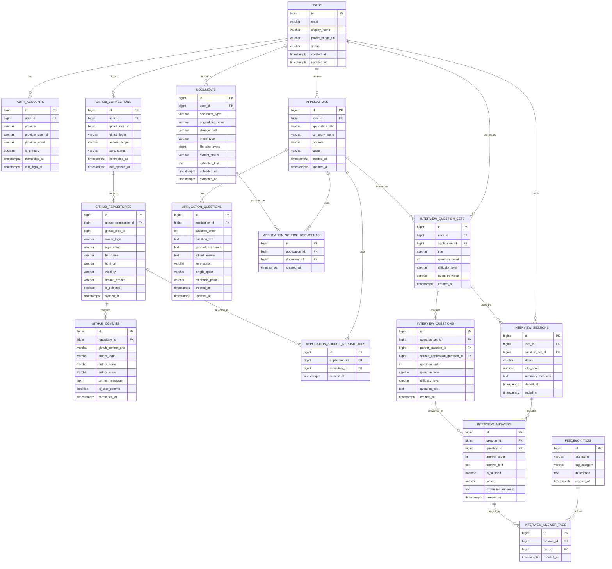

> 이 문서는 `archive/synced/` 보관용 동기화 사본입니다.
> 현재 구현 기준 원본은 `docs/db/erd.md` 입니다.
> 최종 구현·수정 시에는 archive 사본이 아니라 canonical 문서를 우선합니다.

# AI 기술 면접 연습 플랫폼 ERD 초안

## 1. 문서 개요

- 버전: v0.1
- 기준 문서: AI 기술 면접 연습 플랫폼 요구사항 명세서 v0.2
- 목적: 현재 확정된 MVP 요구사항을 기준으로 핵심 엔티티, 관계, 주요 컬럼을 정의하여 이후 상세 ERD, API, 테이블 설계의 기준으로 사용한다.

## 2. 설계 원칙

- 로그인 계정과 GitHub 연동 계정은 분리한다.
  - 사용자는 Google 또는 Kakao로 로그인한 뒤 GitHub를 별도로 연동할 수 있어야 한다.
- 포트폴리오 데이터는 GitHub 저장소/커밋과 업로드 문서로 나눈다.
- 자소서 생성과 면접 질문 생성 흐름은 `application` 중심으로 묶는다.
  - 하나의 지원 건에 대해 회사명, 직무, 자소서 문항, 사용한 포트폴리오 소스가 함께 연결되도록 한다.
- 모의 면접은 질문 세트, 세션, 답변, 태그를 분리하여 저장한다.
  - 질문 생성 이력과 실제 답변 이력을 분리해 관리한다.
- MVP에서는 필수 관계만 우선 반영하고, 운영 로그/비용 로그/재시도 잡 테이블은 후속 확장으로 둔다.

## 3. 핵심 엔티티 목록

- `users`: 서비스 사용자
- `auth_accounts`: OAuth2 로그인 계정 연결 정보
- `github_connections`: GitHub 연동 정보
- `github_repositories`: 연동된 GitHub 저장소
- `github_commits`: 사용자 본인 커밋 정보
- `documents`: 업로드 문서 및 텍스트 추출 결과
- `applications`: 지원 단위 정보
- `application_source_repositories`: 지원 단위에 선택된 저장소
- `application_source_documents`: 지원 단위에 선택된 문서
- `application_questions`: 자소서 문항 및 생성 결과
- `interview_question_sets`: 생성된 면접 질문 세트
- `interview_questions`: 면접 질문 상세
- `interview_sessions`: 모의 면접 세션
- `interview_answers`: 질문별 사용자 답변 및 평가 결과
- `feedback_tags`: 약점 태그 마스터
- `interview_answer_tags`: 답변-태그 연결

## 4. ERD 관계도

## 5. 테이블 상세 정의

### 5.1 users

서비스 사용자 기본 정보 테이블이다.

주요 컬럼
- `id`: PK
- `email`: 대표 이메일
- `display_name`: 사용자 표시명
- `profile_image_url`: 프로필 이미지 URL
- `status`: 사용자 상태(active, withdrawn 등)
- `created_at`, `updated_at`: 생성/수정 시각

비고
- OAuth 로그인 제공자가 여러 개일 수 있으므로 인증 계정 정보는 분리한다.

### 5.2 auth_accounts

OAuth2 로그인 계정 연결 정보를 저장한다.

주요 컬럼
- `id`: PK
- `user_id`: users FK
- `provider`: github, google, kakao
- `provider_user_id`: 제공자 내부 사용자 식별값
- `provider_email`: 제공자 이메일
- `is_primary`: 대표 로그인 계정 여부
- `connected_at`, `last_login_at`: 연결/최근 로그인 시각

권장 제약
- `UNIQUE(provider, provider_user_id)`

### 5.3 github_connections

GitHub 연동 정보를 저장한다.

주요 컬럼
- `id`: PK
- `user_id`: users FK
- `github_user_id`: GitHub 사용자 ID
- `github_login`: GitHub 아이디
- `access_scope`: 권한 범위
- `sync_status`: sync 대기/성공/실패 상태
- `connected_at`, `last_synced_at`: 연결/최근 동기화 시각

비고
- 로그인 계정과 별도로 분리한 이유는 Google 또는 Kakao 로그인 사용자도 GitHub를 연동할 수 있어야 하기 때문이다.

### 5.4 github_repositories

사용자가 연동한 GitHub 계정에서 조회한 저장소 정보를 저장한다.

주요 컬럼
- `id`: PK
- `github_connection_id`: github_connections FK
- `github_repo_id`: GitHub 저장소 ID
- `owner_login`: 저장소 소유자
- `repo_name`, `full_name`: 저장소명
- `html_url`: 저장소 URL
- `visibility`: public/private
- `default_branch`: 기본 브랜치
- `is_selected`: 사용자 선택 여부
- `synced_at`: 최근 동기화 시각

권장 제약
- `UNIQUE(github_connection_id, github_repo_id)`

### 5.5 github_commits

저장소별 사용자 본인 commit 정보를 저장한다.

주요 컬럼
- `id`: PK
- `repository_id`: github_repositories FK
- `github_commit_sha`: 커밋 SHA
- `author_login`, `author_name`, `author_email`: 작성자 정보
- `commit_message`: 커밋 메시지
- `is_user_commit`: 현재 로그인 사용자의 본인 커밋 여부
- `committed_at`: 커밋 시각

권장 제약
- `UNIQUE(repository_id, github_commit_sha)`

### 5.6 documents

이력서, 수상기록 등 업로드 문서와 텍스트 추출 결과를 저장한다.
MVP 기준 지원 형식은 PDF, DOCX, MD이고, 파일 1개당 최대 10MB, 사용자당 기본 5개까지 업로드를 허용한다.

주요 컬럼
- `id`: PK
- `user_id`: users FK
- `document_type`: resume, award, certificate, other
- `original_file_name`: 원본 파일명
- `storage_path`: 저장 경로
- `mime_type`: 파일 MIME 타입
- `file_size_bytes`: 파일 크기
- `extract_status`: 추출 상태
- `extracted_text`: 추출 텍스트
- `uploaded_at`, `extracted_at`: 업로드/추출 시각

### 5.7 applications

지원 단위를 저장한다. 자소서 생성과 면접 질문 생성의 중심 축이 되는 테이블이다.

주요 컬럼
- `id`: PK
- `user_id`: users FK
- `application_title`: 사용자가 구분하기 위한 제목
- `company_name`: 회사명
- `job_role`: 지원 직무
- `status`: draft, ready
- `created_at`, `updated_at`: 생성/수정 시각

비고
- 같은 사용자가 여러 회사/직무 조합으로 여러 지원 단위를 가질 수 있다.

### 5.8 application_source_repositories

특정 지원 단위에서 사용한 GitHub 저장소를 연결한다.

주요 컬럼
- `id`: PK
- `application_id`: applications FK
- `repository_id`: github_repositories FK
- `created_at`: 생성 시각

권장 제약
- `UNIQUE(application_id, repository_id)`

### 5.9 application_source_documents

특정 지원 단위에서 사용한 문서를 연결한다.

주요 컬럼
- `id`: PK
- `application_id`: applications FK
- `document_id`: documents FK
- `created_at`: 생성 시각

권장 제약
- `UNIQUE(application_id, document_id)`

### 5.10 application_questions

자소서 문항과 생성된 답변을 저장한다.

주요 컬럼
- `id`: PK
- `application_id`: applications FK
- `question_order`: 문항 순서
- `question_text`: 자소서 문항
- `generated_answer`: AI 생성 초안
- `edited_answer`: 사용자 수정본
- `tone_option`, `length_option`, `emphasis_point`: 생성 옵션
- `created_at`, `updated_at`: 생성/수정 시각

### 5.11 interview_question_sets

생성된 면접 질문 세트를 저장한다.

주요 컬럼
- `id`: PK
- `user_id`: users FK
- `application_id`: applications FK
- `title`: 질문 세트명
- `question_count`: 질문 수
- `difficulty_level`: 난이도
- `question_types`: 질문 유형 설정값
- `created_at`: 생성 시각

비고
- 하나의 지원 단위에서 여러 질문 세트를 생성할 수 있다.

### 5.12 interview_questions

질문 세트에 포함된 실제 면접 질문을 저장한다.

주요 컬럼
- `id`: PK
- `question_set_id`: interview_question_sets FK
- `parent_question_id`: 꼬리 질문 원문 FK, 없으면 null
- `source_application_question_id`: 자소서 문항 기반 질문일 경우 FK
- `question_order`: 질문 순서
- `question_type`: technical, experience, follow_up 등
- `difficulty_level`: 난이도
- `question_text`: 질문 본문
- `created_at`: 생성 시각

### 5.13 interview_sessions

사용자가 실제로 진행한 텍스트 기반 모의 면접 세션을 저장한다.

주요 컬럼
- `id`: PK
- `user_id`: users FK
- `question_set_id`: interview_question_sets FK
- `status`: in_progress, completed, aborted
- `total_score`: 세션 총점
- `summary_feedback`: 세션 요약 피드백
- `started_at`, `ended_at`: 시작/종료 시각

### 5.14 interview_answers

질문별 사용자 답변과 평가 결과를 저장한다.

주요 컬럼
- `id`: PK
- `session_id`: interview_sessions FK
- `question_id`: interview_questions FK
- `answer_order`: 답변 순서
- `answer_text`: 사용자 답변
- `is_skipped`: 건너뛰기 여부
- `score`: 질문별 점수
- `evaluation_rationale`: 간단한 평가 근거
- `created_at`: 생성 시각

### 5.15 feedback_tags

약점 태그 마스터를 저장한다.

주요 컬럼
- `id`: PK
- `tag_name`: 태그명
- `tag_category`: 카테고리
- `description`: 설명
- `created_at`: 생성 시각

예시
- 근거 부족
- 기술 깊이 부족
- 답변 구조 미흡
- 핵심어 누락
- 경험 연결 부족

### 5.16 interview_answer_tags

질문별 답변에 부여된 약점 태그를 연결한다.

주요 컬럼
- `id`: PK
- `answer_id`: interview_answers FK
- `tag_id`: feedback_tags FK
- `created_at`: 생성 시각

권장 제약
- `UNIQUE(answer_id, tag_id)`

## 6. 주요 관계 정리

- 사용자 1명은 여러 개의 로그인 계정을 가질 수 있다.
- 사용자 1명은 여러 개의 GitHub 연동 정보를 가질 수 있다.
- GitHub 연동 1건은 여러 저장소를 가진다.
- 저장소 1개는 여러 커밋을 가진다.
- 사용자 1명은 여러 문서를 업로드할 수 있다.
- 사용자 1명은 여러 지원 단위를 생성할 수 있다.
- 지원 단위 1개는 여러 저장소와 여러 문서를 소스로 선택할 수 있다.
- 지원 단위 1개는 여러 자소서 문항을 가진다.
- 지원 단위 1개는 여러 면접 질문 세트를 가질 수 있다.
- 질문 세트 1개는 여러 면접 질문을 가진다.
- 질문 세트 1개는 여러 면접 세션에서 재사용될 수 있다.
- 면접 세션 1개는 여러 답변을 가진다.
- 답변 1개는 여러 약점 태그를 가질 수 있다.

## 7. MVP 기준 포함 범위와 제외 범위

### 7.1 이번 ERD에 포함한 것

- OAuth2 로그인 계정 구조
- GitHub 저장소 및 commit 수집 구조
- 업로드 문서 및 텍스트 추출 저장 구조
- 지원 단위별 자소서 문항 저장 구조
- 면접 질문 생성, 세션, 답변, 태그 저장 구조

### 7.2 이번 ERD에서 제외한 것

- PR, Issue 수집 테이블
- 결제, 광고, 토큰 관련 테이블
- 음성/영상 면접 관련 테이블
- 커뮤니티, 통계, 게임화 보상 테이블
- AI 비용 집계 및 프롬프트 로그 상세 테이블
- 비동기 작업 큐, 재시도 잡, 장애 복구 테이블

## 8. 후속 상세 설계 시 결정할 항목

- 문서 파일 저장 방식
  - 로컬 저장소, S3 등 외부 스토리지
- `users.email`의 필수 여부
  - OAuth 제공자별 이메일 제공 정책 차이 반영 필요
- GitHub access token 저장 정책
  - 암호화 저장 여부, 만료 시 갱신 정책
- `applications`를 실제 지원 건 기준으로 강하게 관리할지, 임시 작업 단위까지 허용할지
- `question_types`, `difficulty_level`, `document_type`, `status`를 enum 테이블로 분리할지 여부
- 점수 범위는 0~100 정수로 통일한다.
- 태그 체계는 마스터 테이블 고정 방식으로 운영한다.
- soft delete 적용 범위
- 감사 로그 및 생성 이력 로그 테이블 필요 여부

## 9. 추천 다음 단계

- 이 ERD 초안을 바탕으로 엔티티별 필수/선택 컬럼을 한 번 더 줄인다.
- 이후 PostgreSQL 기준 DDL 초안으로 변환한다.
- 그 다음 API 명세서에서 요청/응답 구조를 엔티티 기준으로 정리한다.

